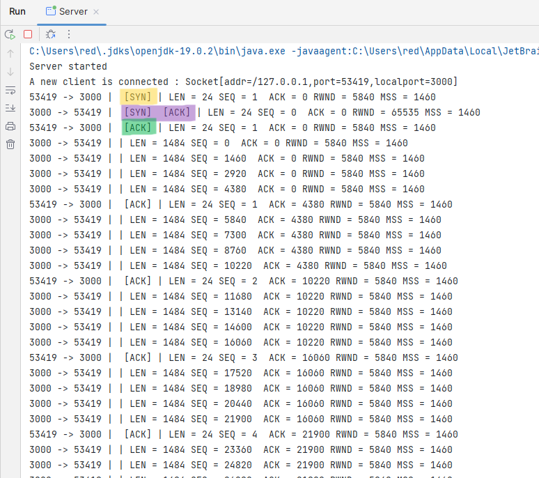
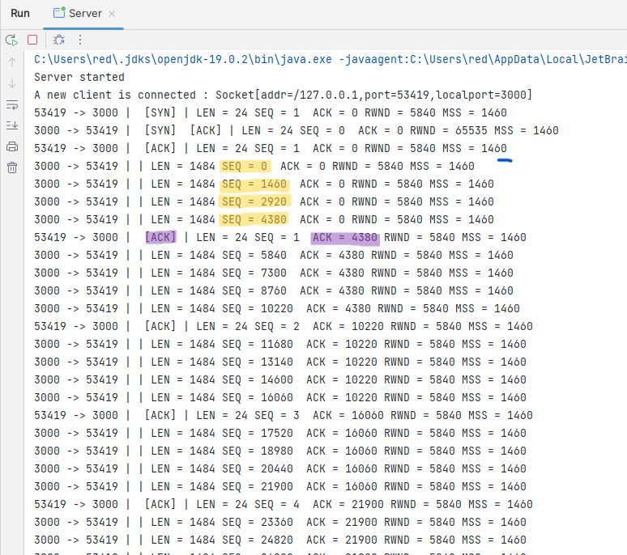
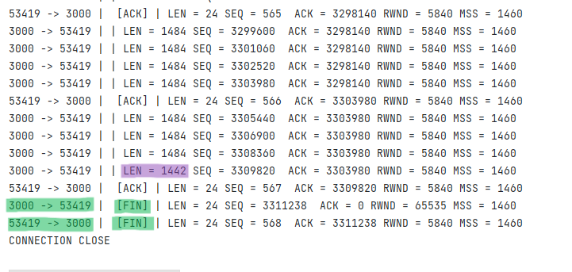
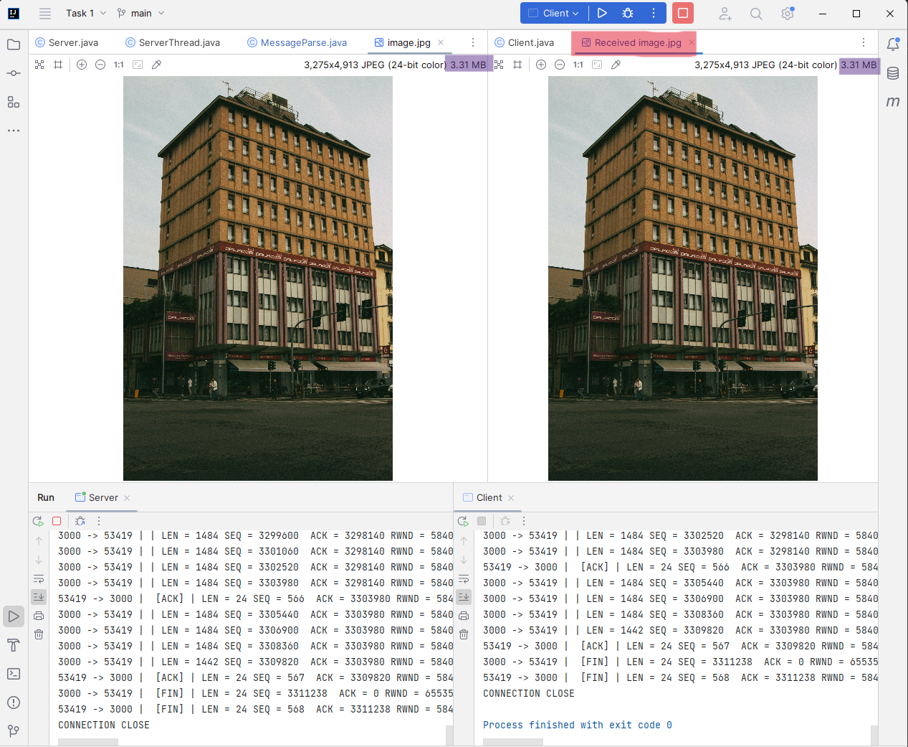
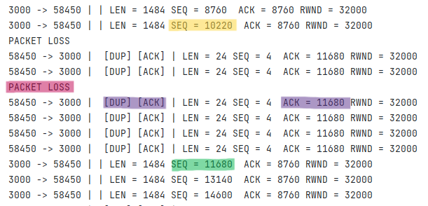
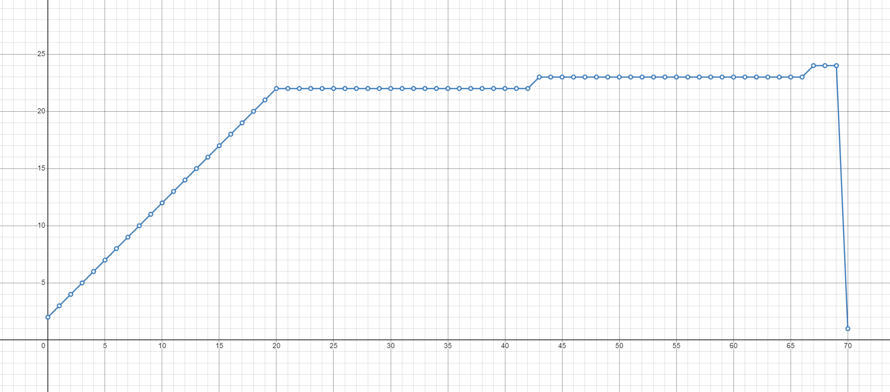
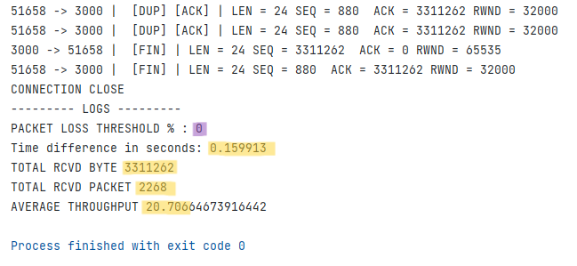
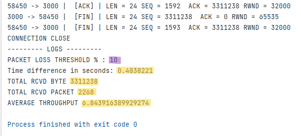

# Introduction

This lab describes the implementation of the Transmission Control
Protocol (TCP) flow control and congestion control algorithm,
specifically the TCP Tahoe variant. TCP is a reliable transport protocol
widely used in the internet for transmitting data between hosts. It
provides several mechanisms for controlling the flow and congestion of
data to ensure reliable and efficient data transfer.

Flow control is used to regulate the amount of data transmitted between
hosts to prevent overwhelming the receiver with too much data at once.
Congestion control is used to avoid network congestion and ensure that
the network remains stable and responsive. TCP Tahoe is a variant of TCP
that implements both flow control and congestion control mechanisms.

This lab report describes the implementation of these mechanisms using
Java and the socket. The implementation includes simulation of network
conditions such as packet loss to test the effectiveness of the TCP
Tahoe algorithm. The report concludes with an analysis of the results
and a discussion of the strengths and limitations of TCP Tahoe in
different network scenarios.

# Objectives

- To gather knowledge about how TCP controls the flow of data between
  a sender and a receiver

- To learn how TCP controls and avoids the congestion of data when a
  sender or receiver detects a congestion in the link in-between them.
  ( TCP Tahoe)

# Theory

TCP is a reliable, connection-oriented protocol that provides a virtual
circuit between two endpoints for transmitting data. TCP flow control
and congestion control are two mechanisms used by TCP to regulate the
flow of data over the network.

TCP flow control ensures that data is transmitted at a rate that the
receiver can handle. The receiver advertises a receive window to the
sender indicating the amount of data it is willing to receive. The
sender then adjusts the amount of data it sends based on this window
size to avoid overwhelming the receiver with too much data at once. This
ensures that the receiver can process the data without dropping packets
or experiencing delays.

TCP congestion control is used to avoid network congestion, which can
occur when there is more traffic on the network than it can handle.
Congestion can cause packet loss, delays, and decreased network
performance. TCP congestion control mechanisms include slow start,
congestion avoidance, and fast recovery.

Slow start is used when a new TCP connection is established or when the
network experiences congestion. The sender starts by sending a small
amount of data and gradually increases the amount of data sent based on
the rate of acknowledgment from the receiver. Congestion avoidance is
used to maintain a stable flow of data over the network by adjusting the
sender's rate of transmission based on network conditions. Fast recovery
is used when a packet is lost or a timeout occurs, allowing the sender
to quickly recover from the loss and resume normal transmission.

TCP congestion avoidance is a mechanism used by TCP to prevent network
congestion when the sender's congestion window (cwnd) is greater than
the slow start threshold (ssthresh). Congestion avoidance algorithms aim
to maintain a stable flow of data over the network by adjusting the
sender's rate of transmission based on network conditions.

When cwnd is greater than ssthresh, TCP enters congestion avoidance
mode. In this mode, the sender increases the congestion window size
linearly rather than exponentially, as in slow start. The increase in
cwnd is calculated using the additive increase approach, where the
sender increases the cwnd by one MSS (Maximum Segment Size) for every
round-trip time (RTT) until congestion is detected. This approach
ensures that the sender does not increase the transmission rate too
quickly and avoids overwhelming the network with too much traffic.

In Java, TCP flow control and congestion control can be implemented
using the socket library. The socket library provides a set of classes
and methods for creating, connecting, and communicating between
endpoints. The flow control and congestion control mechanisms can be
implemented using the socket's send and receive methods, as well as by
manipulating the window size and adjusting the transmission rate based
on network conditions.

# Methodology

The methodology for this lab project report involved the following
steps:

- **System Design and Implementation:** First, we have to design the
  system keeping in mind that we're implementing transport layer
  protocol in application layer.

- **Connection Setup:** First, we implemented TCP client server
  connection, so that data can be sent using appropriate header and
  structure. We followed segment structure of RFC 5681 :
  <https://www.rfc-editor.org/rfc/rfc5681>, RFC 1323 :
  <https://www.rfc-editor.org/rfc/rfc1323>.

- **Flow Control:** We implemented TCP handshake and cumulative
  acknowledgement for communication.

- **Slow Start and Congestion Avoidance:** Then we implemented slow
  start algoritm and congestion avoidance for communication.

- **Performance Test:** Finally, we tested the performance of the
  protocol by introducing packet loss and took measure of it's effect
  on various metric such as throughput, cwnd etc.

# Experimental result

## TCP Flow Control

In this experiment, we want to establish a connection so that, a client
establish a connection with server using tcp three-way handshake and
receive data by using Cumulative Acknowledgments.

First, we set up a class that will put the desired header, options and
header into the appropriate segment structure and another class to parse
data from a given structure.

```Java

 public class MessageFormat {

        /* TCP SEGMENT STRUCTURE


       0                   1 1 1 1 1 1 1 1 1 1 2 2 2 2 2 2 2 2 2 2 3 3
       0 1 2 3 4 5 6 7 8 9 0 1 2 3 4 5 6 7 8 9 0 1 2 3 4 5 6 7 8 9 0 1
      +-+-+-+-+-+-+-+-+-+-+-+-+-+-+-+-+-+-+-+-+-+-+-+-+-+-+-+-+-+-+-+-+
      |           Source Port          |       Destination Port       |
      +-+-+-+-+-+-+-+-+-+-+-+-+-+-+-+-+-+-+-+-+-+-+-+-+-+-+-+-+-+-+-+-+
      |                        Sequence Number                        |
      +-+-+-+-+-+-+-+-+-+-+-+-+-+-+-+-+-+-+-+-+-+-+-+-+-+-+-+-+-+-+-+-+
      |                    Acknowledgment Number                      |
      +-+-+-+-+-+-+-+-+-+-+-+-+-+-+-+-+-+-+-+-+-+-+-+-+-+-+-+-+-+-+-+-+
      |  Data |           |U|A|P|R|S|F|                               |
      | Offset| Reserved  |R|C|S|S|Y|I|            Window             |
      |       |           |G|K|H|T|N|N|                               |
      +-+-+-+-+-+-+-+-+-+-+-+-+-+-+-+-+-+-+-+-+-+-+-+-+-+-+-+-+-+-+-+-+
      |           Checksum            |         Urgent Pointer        |
      +-+-+-+-+-+-+-+-+-+-+-+-+-+-+-+-+-+-+-+-+-+-+-+-+-+-+-+-+-+-+-+-+
      |                    Options (if any)                           |
      +-+-+-+-+-+-+-+-+-+-+-+-+-+-+-+-+-+-+-+-+-+-+-+-+-+-+-+-+-+-+-+-+
      |                             Data                              |
      +-+-+-+-+-+-+-+-+-+-+-+-+-+-+-+-+-+-+-+-+-+-+-+-+-+-+-+-+-+-+-+-+
*/

    /* OPTION (MSS)

     0                   1 1 1 1 1 1 1 1 1 1 2 2 2 2 2 2 2 2 2 2 3 3
     0 1 2 3 4 5 6 7 8 9 0 1 2 3 4 5 6 7 8 9 0 1 2 3 4 5 6 7 8 9 0 1
    +-+-+-+-+-+-+-+-+-+-+-+-+-+-+-+-+-+-+-+-+-+-+-+-+-+-+-+-+-+-+-+-+
    |      Kind     |     Length    | Data (variable)
    +-+-+-+-+-+-+-+-+-+-+-+-+-+-+-+-+-+-+-+-+-+-+-+-+-+-+-+-+-+-+-+-+
*/

            public MessageFormat(int _sourcePort, int _destinationPort, ... ){
             /* Source Port
               0                   1 1 1 1 1 1 1 1 1 1 2 2 2 2 2 2 2 2 2 2 3 3
               0 1 2 3 4 5 6 7 8 9 0 1 2 3 4 5 6 7 8 9 0 1 2 3 4 5 6 7 8 9 0 1
              +-+-+-+-+-+-+-+-+-+-+-+-+-+-+-+-+-+-+-+-+-+-+-+-+-+-+-+-+-+-+-+-+
              |           Source Port         |       Destination Port        |
              +-+-+-+-+-+-+-+-+-+-+-+-+-+-+-+-+-+-+-+-+-+-+-+-+-+-+-+-+-+-+-+-+
         */

            byte[] sourcePort = new byte[2];
            /* Converting integer id to 2 byte array */
            sourcePort[1] = (byte) (_sourcePort & 0xFF);
            sourcePort[0] = (byte) ((_sourcePort >> 8) & 0xFF);

            byte[] destinationPort = new byte[2];
            /* Converting integer id to 2 byte array */
            destinationPort[1] = (byte) (_destinationPort & 0xFF);
            destinationPort[0] = (byte) ((_destinationPort >> 8) & 0xFF);
            }

            ...
            ...
            ...

            }


```

We used the following methods to parse data from message:

```Java
 public class MessageParse {
        byte[] segment;

        public MessageParse(byte[] _segment){
            this.segment = _segment;
        }

        public int sourcePort(){
        long bit1 = unsigned(segment[0]); // UNSIGNED
        long bit2 = unsigned(segment[1]);
        return (int) (bit2 + bit1*256);
        }

        public int destPort(){
            long bit1 = unsigned(segment[2]);
            long bit2 = unsigned(segment[3]);
            return (int) (bit2 + bit1*256);
        }

        ...
        ...
    }

```

For the communcation, we first send a SYN message from the client, and
when server responds with a SYN-ACK client send an ACK. Server gets to
know the Receive Window (rwnd) and Maximum Segement (MSS) from the
handshake.

After that server starts to sends packet containing data of MSS bytes.
Server sends data until the rwnd is full and client then acknowledges
all the received packets.

The client server communication log is demonstrated below:



We can see the three way handshake. Here, client is at port 53212 and
server resides at port 3000. We can see client first receives a SYN
message and responds with a SYN ACK and then client sends the ACK.

In the meantime, server also gets to know the RWND and MSS to be used.

After that, server calculates how much data to send and sends the amount
(RWND/MSS) of packets. When client window is full client acknowledges
all the data altogether. We can see that client acknowledgement no is 4380. in Fig 2.



The server sends more data, only after getting the acknowledgement.

We can see in Fig 3, that the last packet contains less data then MSS,
as file byte has ended. Also after data completely transferred, server
sends a FIN message to close the connection.



We can see in Fig 4, a 3.31 MBs of Data succesfully transfarred without
any corruption.



## TCP Congestion Control

We extended our code, so that after the handshake, server allocates a
variable for cwnd and ssthresh along with some other variable to
maintain and log the communication. We can see that first we setting the
mode as Slow Start.

```Java
int cwnd, ssthresh;
int prevSeq, prevAck, dupAck;
int ackNo, totalSendByte = 0, totalSendPacket = 0;
String SLOW_START = "SLOW START", CONGESTION_AVOIDANCE = "CONGESTION AVOIDANCE";
String selectedMode = SLOW_START;


MessageParse message = new MessageParse(packet);
    ackNo = message.ackNo();

    /* SYN */
    if (message.isSyn()) {
        message.print();
        /* Setting the congestion window (cwnd) to 1 Maximum Segment Size (MSS). */
        cwnd = message.mss();
        /* Setting the slow start threshold (ssthresh) to the size of the receive window */
        ssthresh = message.rwnd();

        dupAck = 0; /* Setting the duplicate ACK counter to 0 */
        prevAck = message.ackNo();
        prevSeq = message.seqNo();

        logSentPacket = new ArrayList<>(); /* RESETTING LOG */
        sendSynAck();
    }
```

When ack is received, we're first checking if it is a dup ack. For three consecutive dup acks we're retransmitting the file by adjusting the sequence number and if not we're adjusting the cwnd, ssthresh and transmit mode.

```Java
/* ACK */
    if (message.isAck()){
        /* CHECK FOR DUP ACK */
        if(prevSeq == message.seqNo() && prevAck == message.ackNo()){
            message.printDupAck();
            dupAck += 1;
        }
        else message.print();

        /* PACKET LOSS */
        if(dupAck < 3) {
            if (cwnd >= ssthresh) selectedMode = CONGESTION_AVOIDANCE;
            if (Objects.equals(selectedMode, SLOW_START)) cwnd += message.mss(); /* For each ACK received, increase cwnd by 1 MSS. */
            if (Objects.equals(selectedMode, CONGESTION_AVOIDANCE)) cwnd += ((message.mss() * message.mss()) / cwnd); /* For each ACK received, increase cwnd by (MSS * MSS) / cwnd  */
        }

        else{
            /* set ssthresh to cwnd/2, set cwnd to 1 */
            ssthresh = cwnd/2;
            cwnd = message.mss();

            /* RETRANSMIT FROM DUP ACKED SEQ */
            seqNo = message.ackNo();
            dupAck = 0;
        }

        prevAck = message.ackNo();
        prevSeq = message.seqNo();

        /* Data */
        sendFile(message.mss(), message.rwnd());

    }

```

The dup action is demonstrated in Figure 5.



We can see in Figure 5 that, a packet is lost after seq 10220. So the
client keeps sending dup ack for every request incoming. The server then
retransmits the data for sequence 11680.

If we keep a log for how many packets is being sent at a time, we can
get a following chart. (Setting Packet loss threshold 0%).



We can see at first that CWND is increasing at a rapid state, which is
the Slow Start algorithm but after a while when cwnd tips the ssthresh
threshold, Transmission Mode is switcher Congestion Avoidance and
tramission increases at a very slow rate.

When we increased the Packet loss threshold to 10%, We found the
following chart.


We can see the slow start alogorithm at first, but whenever a packet is
lost cwnd starts from the initial state.

We measured a throughput of 20MBps when packet loss is set to 0%;



Throughput dropped to only of 6MBps when packet loss is set to 10%;



# Experiences

- Initially, We had to review our understanding of TCP flow control
  and congestion control mechanisms to ensure that we could implement
  them correctly.

- Debugging network code was challenging, as it often involved dealing
  with low-level network protocols that were difficult to understand.
  We faced with data being corrupted for not aligning the bytes
  properly and had to look it's binary value to figure out the
  problem.

- While testing the TCP implementation, we had to keep track of
  performance metrics such as throughput, round-trip time, and packet
  loss rate to determine the effectiveness of our implementation.

- Modifying the TCP implementation to include the congestion avoidance
  algorithm required me to have a deep understanding of how the
  algorithm worked and how to integrate it with my existing code.

- Overall, this project was a challenging but rewarding experience. It
  helped me to gain a deeper understanding of TCP protocols and
  network programming and develop valuable skills in software
  development and debugging.

## Bibliography

RFC 5681 : <https://www.rfc-editor.org/rfc/rfc5681>

RFC 1323 : <https://www.rfc-editor.org/rfc/rfc1323>

How TCP really works :
<https://www.youtube.com/watch?v=rmFX1V49K8U&t=218s>
:::
